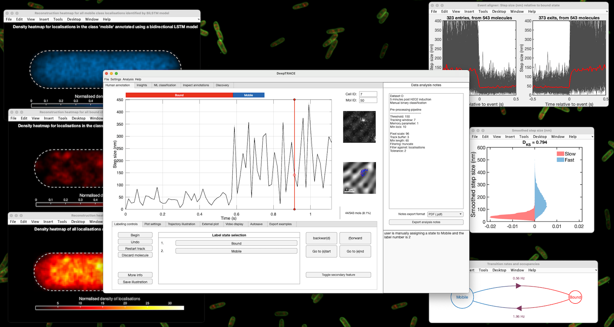

# DeepTRACE
[](https://doi.org/10.5281/zenodo.18869232) [](https://doi.org/10.1038/s42003-026-09899-y)

DeepTRACE is the software accompanying the publication:

Pambos, O.J., Wright, J.A.R. & Kapanidis, A.N., **DeepTRACE brings flexible machine learning to single-molecule track analysis**. Commun Biol (2026). [https://doi.org/10.1038/s42003-026-09899-y](https://doi.org/10.1038/s42003-026-09899-y)

This repository hosts the actively maintained DeepTRACE codebase.

DeepTRACE is a tool for analysing long single-molecule tracking data in living cells using machine learning. It is designed for experiments that capture multi-stage biological processes by learning patterns of molecular behaviour from motion, subcellular location, and photometric readouts. Users can annotate tracks, construct bespoke models, segment molecular behaviours, and perform quantitative analysis to assist biological interpretation of single-molecule tracking data. Models can be trained on datasets containing a few hundred tracks without specialised hardware. DeepTRACE accepts arbitrary numerical readouts as input, enabling native handling of emerging single-molecule photometric techniques (e.g. smFRET, anisotropy). Quantitative and visual analysis tools are built directly into the GUI, covering diffusion analysis, temporal analysis including state residence times and transition matrices, spatial mapping, feature selection guidance, and interactive track inspection.


*The DeepTRACE interface during human annotation of a single molecule track. Several downstream analysis tools are shown in the background.*

---

## Installation
### Requirements
- MATLAB R2024a or later (tested on R2025a), with the following toolboxes:
	- Optimisation Toolbox
	- Signal Processing Toolbox
	- Deep Learning Toolbox
	- Image Processing Toolbox
	- Statistics and Machine Learning Toolbox
	- Bioinformatics Toolbox
- macOS, Windows, or Linux.
- For optimal performance during manual annotation, datasets should be stored on a fast internal SSD.

---

### Setup Method 1: Manual Download
If you do not use Git, the following steps will set up DeepTRACE on your system:

1. Download the code as a zip file from the `[<> Code]` button at the top of the repo's GitHub web page, and unzip on your local machine.
2. At the MATLAB Command Window enter:
```matlab
addpath(genpath('path_to_unzipped_DeepTRACE'))
savepath
```
3. Launch DeepTRACE by typing `DeepTRACE` in the Command Window.

On some systems the `savepath` command requires administrator access. If so, an alternative to step 2 above is to add the `addpath(genpath('path_to_unzipped_DeepTRACE'))` command to the `startup.m` file so that the DeepTRACE path is configured automatically each time MATLAB starts.

---

### Setup Method 2: Using Git
If you already use Git:

1. Clone this repository:
```bash
git clone https://github.com/opambos/DeepTRACE.git
```
2. In the MATLAB Command Window enter the following to add the repository folder to your MATLAB path:
```matlab
addpath(genpath('path_to_DeepTRACE'))
savepath
```
3. Launch DeepTRACE by typing `DeepTRACE` in the MATLAB Command Window.

On some systems the `savepath` command requires administrator access. If so, an alternative to step 2 above is to add the `addpath(genpath('path_to_DeepTRACE'))` command to the `startup.m` file so that the DeepTRACE path is configured automatically each time MATLAB starts.

---

## User Guide and Documentation
A guide for use of DeepTRACE is available in the [DeepTRACE wiki](https://github.com/opambos/DeepTRACE/wiki), with additional sections currently being expanded.

For first-time users, we recommend starting with the **User Guide** in the wiki, which walks through the complete workflow from data import to analysis.

---

## Input Formats
DeepTRACE requires the following input files:
- Tracking data (TrackMate or LoColi formats) or Localisation data (Picasso format)
- Cell segmentations (MicrobeTracker format)
- Fluorescence video recordings (.tif or .fits)
- Reference image (.tif or .fits)
- Optional: ground truth data for training on simulated data (.csv)

Support for additional localisation and tracking pipelines is under active development. If your pipeline isn't listed, please get in touch.

---

## Contact and Support
DeepTRACE is under continuous active development. For questions, bug reports, or feature requests, please contact oliver.pambos@physics.ox.ac.uk.